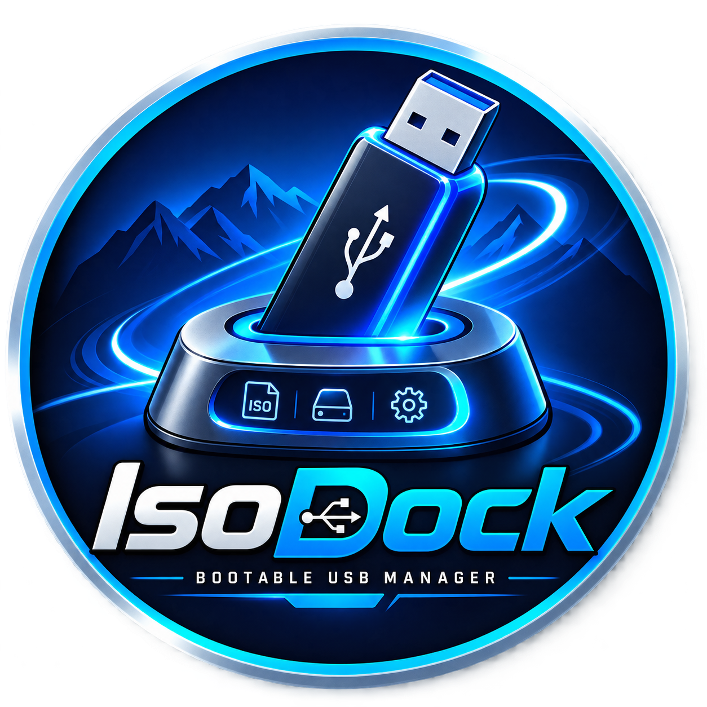
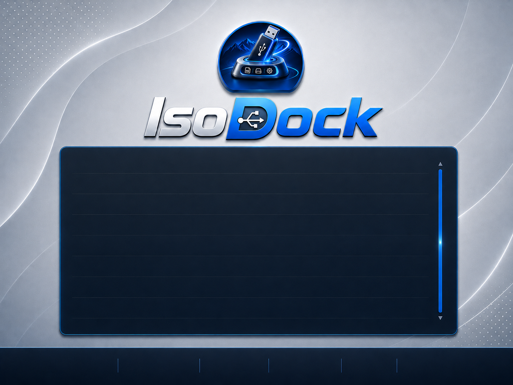

<p align="center">
  
</p>

<h1 align="center">IsoDock</h1>

<p align="center"><strong>Bootable USB Manager for Linux</strong></p>

<p align="center">
  A downstream Linux desktop distribution of the Ventoy 1.1.17 open-source engine,
  with IsoDock branding, Debian packaging, diagnostics, and a custom multiboot theme.
</p>

> **Independent project:** IsoDock is not affiliated with or endorsed by the official Ventoy project. Ventoy remains the underlying boot/disk engine and retains its original copyright and license notices.

## Status

- IsoDock: **1.0.0-6**
- Ventoy engine: **1.1.17**
- Architecture: **amd64 / x86_64**
- Desktop UI: **native GTK3**
- License for IsoDock downstream changes: **GPL-3.0-or-later**
- Release status: **production candidate — physical USB/firmware QA still required before calling a build hardware-certified**

## Boot interface

<p align="center">
  
</p>

The image above is extracted from the actual VTOYEFI image used by IsoDock. ISO filenames are **not** painted into the wallpaper; the boot engine renders the real files present on the USB dynamically.

### Real boot shortcuts

| Key | Function |
| --- | --- |
| `Enter` | Boot selected ISO/image |
| `L` | Language |
| `F1` | Help |
| `F2` | Browse |
| `F3` | ListView / TreeView |
| `F4` | Localboot |
| `F5` | Tools |
| `F6` | Extended menu |

## Features

- Native Linux GTK3 interface for install/update operations.
- Multiboot ISO/image workflow powered by Ventoy 1.1.17.
- BIOS and UEFI boot payloads.
- Secure Boot payload retained from the upstream engine image.
- MBR/GPT options through the upstream engine.
- IsoDock boot theme with dynamic ISO listing.
- USB automount fix for mount paths containing spaces.
- Per-user configuration/log paths instead of modifying packaged files.
- Runtime SHA-256 manifest and `isodock --doctor` diagnostics.
- Reproducible Debian package scripts.
- Pinned upstream source retrieval for corresponding-source builds.

## Install a built `.deb`

```bash
sudo apt install ./isodock_1.0.0-6_amd64.deb
isodock --doctor
isodock
```

**Warning:** installing a boot manager to a USB device is destructive. Always verify the selected disk and test first with disposable media.

## Build from this repository

### 1. Install build dependencies

On Debian/Ubuntu/Zorin-style systems:

```bash
sudo apt update
sudo apt install -y \
  git gcc make xz-utils rsync dpkg-dev \
  libgtk-3-0 util-linux fdisk parted dosfstools udev policykit-1
```

Optional GUI smoke tests use `xvfb`.

### 2. Verify the downstream tree

```bash
make verify
```

### 3. Build the Debian package

```bash
make deb
```

Output:

```text
out/isodock_1.0.0-6_amd64.deb
```

### 4. Rebuild the boot image from pinned upstream source

```bash
make boot-image
make verify
make deb
```

`make boot-image` fetches the exact Ventoy upstream commit pinned in `VERSION`, applies the documented IsoDock downstream changes, and rebuilds the VTOYEFI payload.

## Corresponding source / upstream policy

This repository contains the complete IsoDock downstream source, packaging, theme assets, generated-runtime manifests, and the scripts needed to reconstruct the modified upstream tree.

The upstream Ventoy source is pinned to:

```text
Ventoy 1.1.17
commit 7cbdc5cf69935bcf1f085ae67f40e70ea7e74bae
```

Run:

```bash
make prepare-upstream
```

to fetch the pinned upstream source into `.cache/upstream/Ventoy` and apply the IsoDock modifications. For redistributable source releases, use:

```bash
make source-archive
```

which includes the pinned upstream tree together with the downstream source. See [`UPSTREAM.md`](UPSTREAM.md) and [`SOURCE-POLICY.md`](SOURCE-POLICY.md).

## Repository layout

```text
boot-theme/          IsoDock GRUB theme and selection/scroll assets
branding/            IsoDock application and boot branding
icons/               Linux hicolor desktop icons
packaging/           Debian package metadata and launcher
runtime-template/    Runtime payload used by the .deb build
scripts/             Build, source-fetch and release tooling
tests/               Static/integrity/regression tests
tools/               Source utilities (including FAT image helper)
assets/               Mockups and verified extracted boot assets
docs/                 Installed documentation and third-party licenses
```

## Contributing

Contributions are welcome. Please read [`CONTRIBUTING.md`](CONTRIBUTING.md), [`CODE_OF_CONDUCT.md`](CODE_OF_CONDUCT.md), and [`SECURITY.md`](SECURITY.md) first.

For changes touching disk writes or boot logic, provide a reproducible reason, tests, and physical-media QA results where possible. The project intentionally avoids unnecessary rewrites of the proven upstream writer.

## License and attribution

IsoDock downstream modifications are licensed under **GNU GPL v3 or later**. See [`LICENSE`](LICENSE).

Ventoy and bundled third-party components retain their own applicable licenses and notices. See [`THIRD-PARTY-NOTICES.md`](THIRD-PARTY-NOTICES.md), [`docs/licenses/`](docs/licenses/), and [`UPSTREAM.md`](UPSTREAM.md).

## Project links

- Repository: https://github.com/delacruzedward735-hash/ISODock
- CodeDev by Edward: https://codedev-by-edward.myportfoliohub.online/
- MyPortfolioHub: https://www.myportfoliohub.online/
